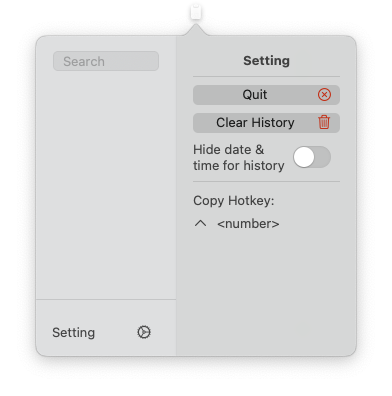
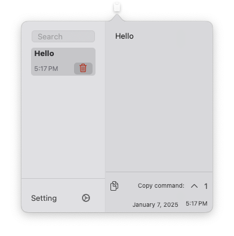

  
   <a href="https://apps.apple.com/us/app/clipboard-history/id6740091912?mt=12">
     
Download from Mac AppStore

  </a>

# clipboard_history

The app keeps track of textual clipboard history data and allows the user to copy previous clipboard data using ctrl + \<number\>

